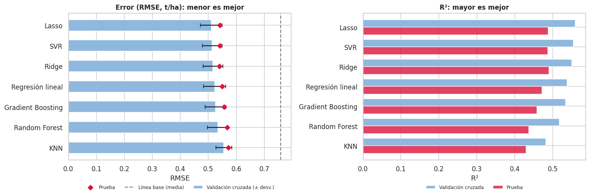
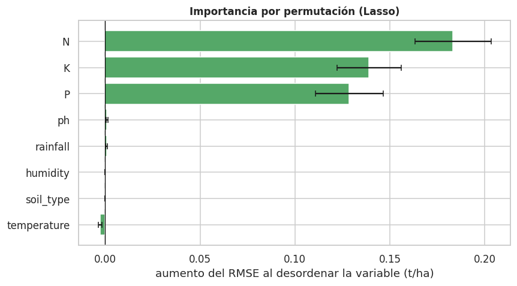

# 🌾 Predicción del rendimiento agrícola (t/ha)

Proyecto de Machine Learning de **regresión supervisada**: ¿se puede predecir el rendimiento de un cultivo en toneladas por hectárea (`yield_ton_ha`) a partir de las características del suelo y las condiciones ambientales?

El repositorio incluye el análisis completo (notebook), el modelo entrenado y una app de **Streamlit** para hacer predicciones con un intervalo de incertidumbre.

## Resultados

Modelo elegido: **Lasso** (menor RMSE en validación cruzada de 5 pliegues entre 7 modelos). Métricas en el 20 % de prueba, evaluado una sola vez:

| R² | RMSE | MAE | MAPE | Mejora frente a predecir la media |
|---|---|---|---|---|
| 0,488 | 0,541 t/ha | 0,433 t/ha | 12,5 % | 28,6 % menos de error cuadrático |

Hallazgos principales:

- Casi toda la capacidad predictiva está en **nitrógeno (N), fósforo (P) y potasio (K)**, con relación aproximadamente lineal. Temperatura, humedad, pH, lluvia y tipo de suelo no aportan información en estos datos: un modelo solo con N, P y K rinde igual.
- Los modelos lineales igualan o superan a Random Forest, KNN y Gradient Boosting.
- Los valores inválidos (`N` negativo o 500, `ph` 0,5 o 14, `rainfall` −10 o 2000) se corrigen sin perder filas: la lluvia se reconstruye desde `rainfall_inches`.
- El modelo explica cerca de la mitad de la variabilidad: sirve para orientar y comparar escenarios, no para fijar con precisión el rendimiento de una parcela. Por eso la app muestra un **intervalo de predicción del 95 %** (≈ ±1 t/ha).

<p align="center">
  
</p>
<p align="center">
  
</p>

## Estructura del repositorio

```
├── app.py                  # App de Streamlit
├── utils.py                # Carga del modelo y predicción con intervalo
├── requirements.txt        # Dependencias de la app
├── requirements-dev.txt    # + pytest
├── notebooks/              # Análisis completo y entrenamiento
├── models/                 # modelo_rendimiento.joblib + metadata.json
├── data/                   # crop_clean.csv (el CSV crudo NO se sube, ver abajo)
├── reports/figures/        # Gráficos del análisis
├── tests/                  # Pruebas de la lógica de predicción
└── .github/workflows/      # CI: compila y ejecuta las pruebas
```

## Cómo ejecutarlo

### 1. Entrenar (una vez) y generar el modelo

Abre `notebooks/Proyecto_ML_Rendimiento_Agricola.ipynb` en Google Colab o en local, sube `Crop_Agriculture.csv` y ejecuta todas las celdas. Genera:

- `models/modelo_rendimiento.joblib` y `models/metadata.json`
- `data/crop_clean.csv`
- `requirements.txt` con la versión exacta de scikit-learn usada (en Colab llega dentro de `artefactos_despliegue.zip`)

Copia esos archivos a este repositorio. **Usa el `requirements.txt` generado**: un modelo serializado solo es seguro de cargar con la misma versión de scikit-learn con la que se guardó.

### 2. Probar la app en local

```bash
python -m venv .venv
source .venv/bin/activate        # Windows: .venv\Scripts\activate
pip install -r requirements-dev.txt
pytest -q
streamlit run app.py
```

### 3. Desplegar en Streamlit Community Cloud

1. Entra en <https://share.streamlit.io> con tu cuenta de GitHub.
2. **Create app** → elige este repositorio, rama `main`, archivo principal `app.py`.
3. **Deploy**. Cada `git push` a `main` actualiza la app.

## Nota sobre los datos

`Crop_Agriculture.csv` contiene nombres completos y teléfonos, así que está en el `.gitignore` y no debe subirse a un repositorio público. Los datos limpios (`data/crop_clean.csv`) ya no incluyen esas columnas.

## Limitaciones

- Dataset de carácter didáctico (1.200 filas, 240 en prueba), con ruido introducido a propósito en varias columnas. Las relaciones describen este conjunto y no deben extrapolarse tal cual a la agricultura real.
- El 96 % de los registros son de Colombia.
- Variables que probablemente explican la otra mitad de la variabilidad (cultivo o variedad, manejo, fecha de siembra, riego, fertilización) no están en los datos.
